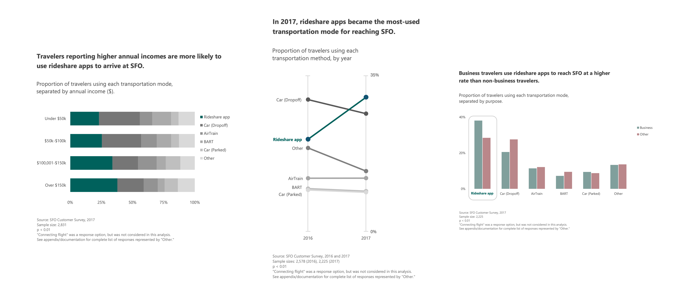

# SFO Transportation Data Visualization

This project addresses a key business problem for San Francisco International Airport (SFO): understanding and optimizing transportation patterns to enhance traveler satisfaction. By analyzing transportation data, the project identifies trends and highlights behavioral differences between traveler segments.

## Business Problem
In this scenario, SFO seeks guidance from an outside consulting firm about potential adaptations to changing transportation preferences and traveler behavior. The firm must analyze the survey responses, visualize the results in a presentation, and offer data-driven recommendations. (Note: the scope of this research is intentionally limited to 3 visualizations in order to make it a portfolio-appropriate project.)

Key challenges include:
- Data completeness and consistency
- Effective traveler segmentation
- Dataset is large, multifaceted, and coded
- Statistical methods used must take into account test assumptions, response weights, and differing sample sizes year-over year.

## Final Visualizations


### Key Findings
- Rideshare app usage has increased year over year among all travelers at SFO.
- Higher-income travelers are more likely to use rideshare apps to reach the airport.
- Business travelers rely more heavily on rideshare options compared to non-business travelers.

## Proposed Solution
This project delivers:
- **Analysis**: An exploration of transportation patterns at SFO, including year-over-year trends and traveler segment behavior.
- **Visualizations**: Excel-based static visualizations styled to reflect professional consulting deliverables. These present year-over-year trends, income-level comparisons, and differences between business and non-business travelers.
- **Recommendations**:
     - Investigate factors driving increased reliance on rideshares
         - Identify the pain points that rideshares are addressing and explore whether any of these issues can be alleviated through alternative transportation methods.
     - Evaluate the impact of business vs. non-business travel on transportation decisions
         - Look deeper into how travel purpose influences transportation choices, and consider potential service adjustments for each group.
     - Explore opportunities for targeted marketing or informational campaigns
         - Use demographic data to identify statistically significant segments and tailor campaigns or informational materials that address their specific transportation needs.
     - Do all of the above bearing in mind the relatively weak effect size of the factors researched here.

## Data Source
- The dataset includes individual, anonymized survey responses related to customer experience at SFO. Specific data details can be found by clicking [here](https://data.sfgov.org/Transportation/2016-SFO-Customer-Survey/t3vr-buhp/about_data) for 2016, and [here](https://data.sfgov.org/Transportation/2017-SFO-Customer-Survey/nnh5-5rwz/about_data) for 2017.
- The latest versions of the Excel workbooks used in this project can be viewed using the OneDrive link [here](https://1drv.ms/f/c/854e97c8f38cec29/Ev5r09aNAkpMqS3MXzqXLCQB9cOakI3zikrt1w5l1kZ5aA?e=1bGKHw).

## Project Files
- `/visualizations/`: Includes PNG files with charts and graphs styled after consulting presentations, including the combined version shown above.
- `/docs/`: Descriptions of the methods, analysis, and detailed recommendations.

## How to Use
1. (Optional) Download the datasets linked in the Data Source section to view the raw CSV files.
2. Navigate to the OneDrive links above, to explore the cleaned data, statistical tests, and in-workbook graphs.
3. Clone this repository to your local machine:
   ```bash
   git clone https://github.com/michaeljhanley/sfo-transportation-viz.git
   ```
4. Navigate to the `/visualizations/` folder to view standalone versions of the final visualizations.
5. Refer to `/docs/` for insights and context.

## Future Work
- Gather and analyze qualitative transportation survey data
- Consider adding questions related to geographical origin
- Add cost data (exact or categorized)
- Analyze rideshare use in relation to time-of-day and day-of-week data
    - Compare rideshare usage trends with existing data on travel times to identify patterns or anticipate potential demand spikes.
        - The latter might also be done using machine learning.

## License
TBD

## Acknowledgments
Special thanks to DataSF, the City of San Francisco, and San Francisco International Airport for providing the public data used in this project.
